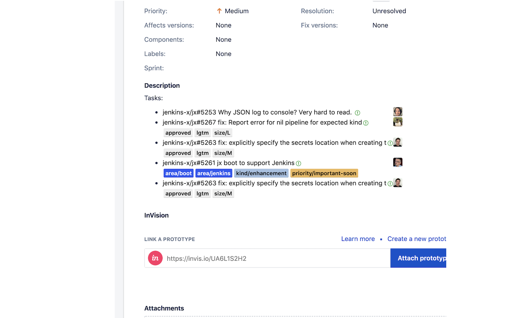

# GitHub Issue Link Status for JIRA

  [badge-cws]: https://img.shields.io/chrome-web-store/v/jcckpiiaadicchhlnkakbpdbfhjekmga.svg?label=
  [link-cws]: https://chrome.google.com/webstore/detail/github-issue-link-status/jcckpiiaadicchhlnkakbpdbfhjekmga "Version published on Chrome Web Store"

ILS for JIRA is a browser extension based on [GitHub Issue Link Status](https://github.com/fregante/github-issue-link-status) that add details to issue and PR links in JIRA (cloud hosted) to see their status (open, closed, merged), their title, their labels and their assignee. It uses GraphQL to make a single HTTP request to check all the links on a page at once. This means that **you'll need to create a API token and add it to the Options page or else the extension will not work.**

## Installation 

  + [**Chrome** extension](https://chrome.google.com/webstore/detail/github-issue-link-status/jcckpiiaadicchhlnkakbpdbfhjekmga) [![(version)][badge-cws]][link-cws]
  + Opera - Use [this Opera extension](https://addons.opera.com/en/extensions/details/download-chrome-extension-9/) to install the Chrome version.

## See Also

- [Refined GitHub](https://github.com/sindresorhus/refined-github/) - Browser extension that simplifies the GitHub interface and adds useful features
- [GitHub Issue Link Status](https://github.com/fregante/github-issue-link-status)